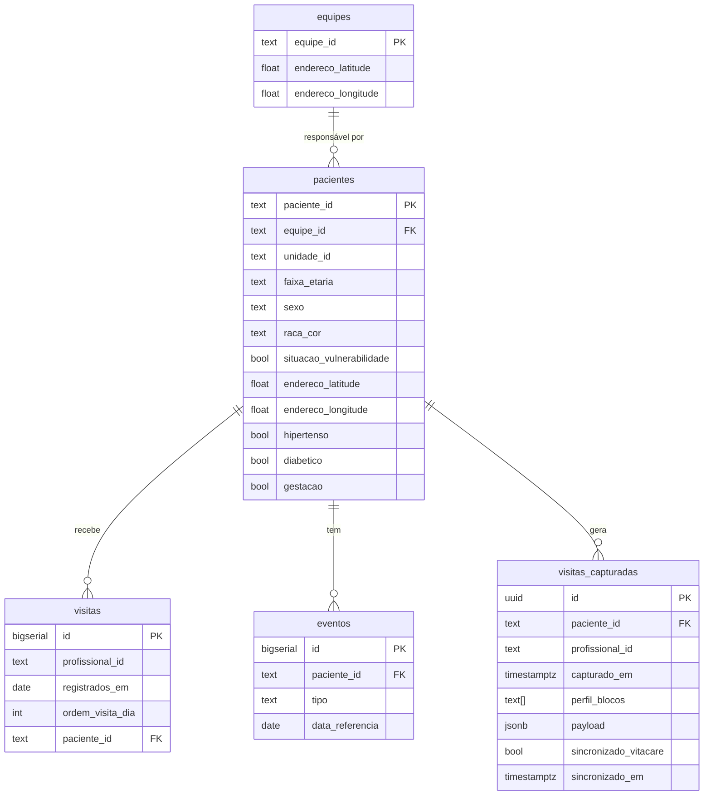

# Integração com Supabase

Este documento descreve o backend do MVP: URL do projeto, chaves, schema das
tabelas e exemplos de uso.

## 1. Projeto Supabase

| Campo | Valor |
|---|---|
| URL | `https://gyutcqmrbbtftrowcyhv.supabase.co` |
| Região | South America (São Paulo) — `aws-1-sa-east-1` |
| Postgres | 17.6 |
| Project ref | `gyutcqmrbbtftrowcyhv` |

## 2. Variáveis de ambiente

Copie `.env.example` para `.env.local` e preencha:

```bash
NEXT_PUBLIC_SUPABASE_URL=https://gyutcqmrbbtftrowcyhv.supabase.co
NEXT_PUBLIC_SUPABASE_ANON_KEY=<pega no painel: Project Settings → API → anon public>
```

A **`anon key`** é pública (vai no client). A `service_role` **nunca** vai no
front — só backend (server actions, route handlers).

> Peça a anon key para o Vinicius. Ela rotaciona se a senha do banco for
> rotacionada — combine antes de subir pra produção.

## 3. Setup do client

```bash
pnpm add @supabase/supabase-js
```

```ts
// lib/supabase.ts
import { createClient } from '@supabase/supabase-js'
import type { Database } from './database.types'

export const supabase = createClient<Database>(
  process.env.NEXT_PUBLIC_SUPABASE_URL!,
  process.env.NEXT_PUBLIC_SUPABASE_ANON_KEY!
)
```

### Gerar types TypeScript a partir do schema

```bash
npx supabase gen types typescript \
  --project-id gyutcqmrbbtftrowcyhv \
  > lib/database.types.ts
```

(roda quando precisar atualizar tipos — exige `supabase login`).

## 4. Schema das tabelas



### Notas por tabela

- **`equipes`** — 49 linhas. Lat/long é o ponto de partida do ACS (sede da
  unidade de saúde).
- **`pacientes`** — 97.938 linhas. Flags clínicas e demográficas + endereço
  com ruído de até 100 m (anonimização).
- **`eventos`** — 100.503 linhas. `tipo` ∈ `{agendamento,
  urgencia-emergencia-ou-internacao}`. Datas estão *date-shifted* mas com a
  sequência preservada.
- **`visitas`** — 159.599 linhas. Histórico de visitas dos ACS em 2025.
- **`visitas_capturadas`** — vazia. **Esta é a tabela onde o app grava cada
  visita preenchida em campo.** Estrutura abaixo.

### `visitas_capturadas` — payload do form

| Coluna | Tipo | Descrição |
|---|---|---|
| `id` | `uuid` (auto) | PK |
| `paciente_id` | `text` | FK → `pacientes` |
| `profissional_id` | `text` | ACS que captou (id da tabela `visitas`) |
| `capturado_em` | `timestamptz` (auto) | `now()` no insert |
| `perfil_blocos` | `text[]` | quais blocos do form foram aplicados (ex.: `['hipertenso','pos_urgencia']`) |
| `payload` | `jsonb` | respostas do form — varia por perfil |
| `sincronizado_vitacare` | `boolean` | `false` por padrão, vira `true` quando o Vitacare aceitar |
| `sincronizado_em` | `timestamptz` | quando sincronizou |

#### Estrutura sugerida do `payload` por bloco

```jsonc
{
  "hipertenso": {
    "pa_sistolica": 140,
    "pa_diastolica": 90,
    "adesao_medicacao": false,
    "motivo_nao_adesao": "efeito colateral"
  },
  "diabetico": {
    "glicemia_capilar": 180,
    "adesao_medicacao": true,
    "uso_insulina": false
  },
  "gestante": {
    "idade_gestacional_semanas": 28,
    "fez_consulta_prenatal_mes": true,
    "queixas": ["edema membros inferiores"]
  },
  "puericultura": {
    "vacinas_em_dia": true,
    "amamentando": true,
    "marcos_dev_adequados": true
  },
  "pos_urgencia": {
    "motivo_urgencia": "crise hipertensiva",
    "sintomas_atuais": ["tontura"],
    "uso_de_medicacao_correto": false
  },
  "observacao_livre": "Família relatou dificuldade de acesso à medicação."
}
```

> Os blocos disponíveis e as perguntas saem dos formulários do **e-SUS AB**
> e dos **manuais do ACS** (Ministério da Saúde). A lista exata é definida no
> próprio app — o backend só guarda como `jsonb`.

## 5. Exemplos de queries

### Listar pacientes de uma equipe

```ts
const { data, error } = await supabase
  .from('pacientes')
  .select('paciente_id, faixa_etaria, sexo, hipertenso, diabetico, gestacao, situacao_vulnerabilidade')
  .eq('equipe_id', equipeId)
```

### Buscar última visita de um paciente

```ts
const { data } = await supabase
  .from('visitas')
  .select('registrados_em, profissional_id')
  .eq('paciente_id', pacienteId)
  .order('registrados_em', { ascending: false })
  .limit(1)
```

### Eventos clínicos recentes de um paciente

```ts
const { data } = await supabase
  .from('eventos')
  .select('tipo, data_referencia')
  .eq('paciente_id', pacienteId)
  .gte('data_referencia', '2025-10-01')
  .order('data_referencia', { ascending: false })
```

### Gravar uma visita preenchida em campo

```ts
const { data, error } = await supabase
  .from('visitas_capturadas')
  .insert({
    paciente_id: pacienteId,
    profissional_id: acsId,
    perfil_blocos: ['hipertenso', 'pos_urgencia'],
    payload: {
      hipertenso: { pa_sistolica: 140, pa_diastolica: 90, adesao_medicacao: false },
      pos_urgencia: { motivo_urgencia: 'crise hipertensiva' },
      observacao_livre: 'Filha ajuda com a medicação.'
    }
  })
  .select()
  .single()
```

## 6. Segurança (estado atual + roadmap)

**Hoje (MVP):**
- RLS **desativado** — anon key tem leitura/escrita total nas 5 tabelas.
- Defensável no contexto do hackathon: dataset é o anonimizado oficial
  (k-anon ≥ 5, date-shifted, ruído geo 100 m).

**Antes de qualquer paciente real:**
- Ligar **Row Level Security** com policies que comparam
  `auth.jwt() -> 'equipe_id'` com a coluna `equipe_id` (filtra leitura por
  equipe; gestor vê unidade; coordenador vê AP).
- Trocar dropdown de ACS por **ConecteSUS Profissional** (OIDC), com claims
  carregando `equipe_id` / `unidade_id` / role.
- Audit log com `pg_audit` ou trigger em todas as leituras individuais de
  paciente.

## 7. Performance

Os parquets já foram carregados com índices em:

- `pacientes (equipe_id)`, `pacientes (unidade_id)`
- `eventos (paciente_id, data_referencia DESC)`, `eventos (tipo)`
- `visitas (paciente_id, registrados_em DESC)`, `visitas (profissional_id, registrados_em DESC)`
- `visitas_capturadas (paciente_id, capturado_em DESC)`, `visitas_capturadas (profissional_id, capturado_em DESC)`

Queries por `equipe_id` ou `paciente_id` rodam abaixo de 50 ms remoto.

## 8. Recarregar / resetar dados

O script de carga vive em outro repo
(`impact-lab-saude-17/claude-impact-lab-saude/scripts/setup_supabase.py`).
Roda assim:

```bash
export SUPABASE_DB_URL='postgresql://postgres.gyutcqmrbbtftrowcyhv:<senha>@aws-1-sa-east-1.pooler.supabase.com:5432/postgres'
uv run python scripts/setup_supabase.py
```

Ele **dropa as tabelas e recria** — não rode em produção.

## 9. Suporte

Dúvidas: abra issue ou fale com o Vinicius.
